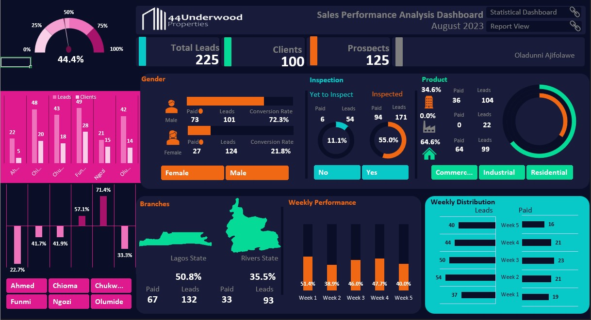
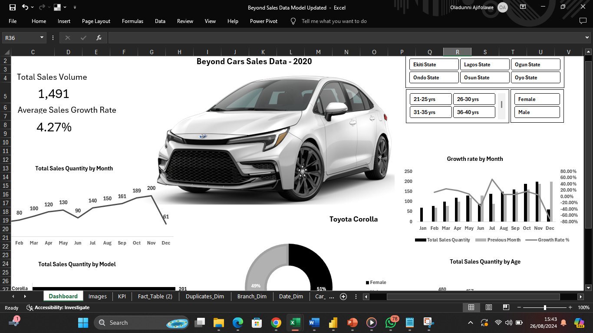
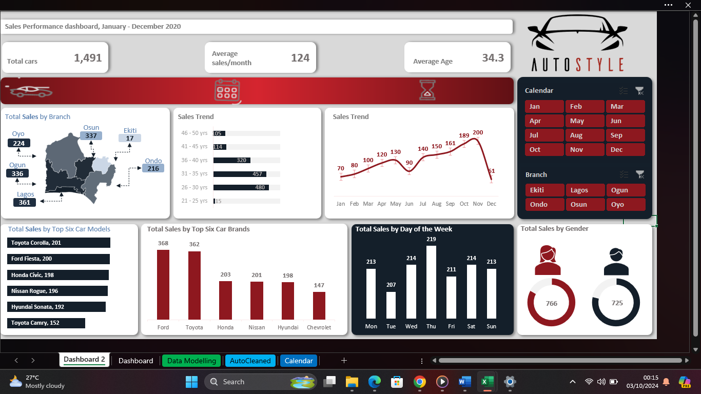
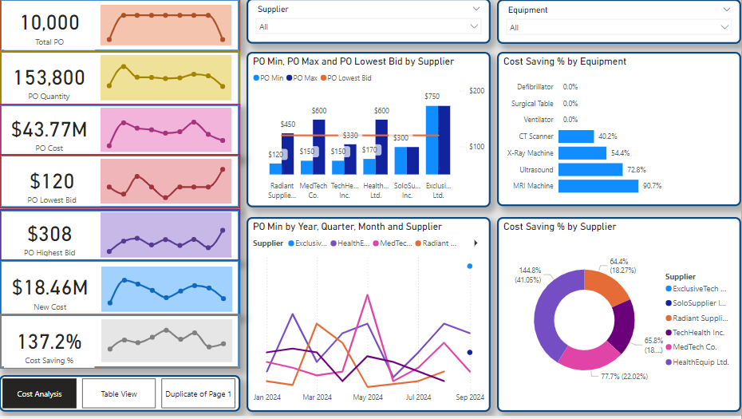

# portfolio
<!--Section 1: Introduce your self-->
## ABOUT ME

Hi there! I am Oladunni, a highly skilled Data and Business Intelligence Analyst with a passion to help businesses make effective use of their data, from understanding the measures and metrics that are important to them, capturing these measures effectively, and supporting their evidence-based decision-making, for business growth and development.   

<!--Mention your top/relevant skills here - core and soft skills-->
## WHAT I DO

*As an analyst, I translate complex data into valuable and actionable insights with an in-depth knowledge of data manipulations, data modelling, analysis and dashboard building for visualization.*

**- ✅ Skills.**
I have a strong knowledge of Advanced Excel, Power BI, Tableau, SQL, R and PowerPoint. 

**- ✅ Goals.**
My goal as an analyst is to use my proven problem solving, critical thinking and analytical skills to help businesses gain the necessary insights, improve results, and make the right decisions for cost-savings and overall business growth.

<!--Section 2: List 3-4 key projects-->
## MY PORTFOLIO 

*A glimpse of some of the projects I've been working on.*

**Car Sales Performance Analysis**

This Project involved analyzing the sales of cars in an Auto company across 6 branches

Goal: To understand the factors that affect the sales trend across the 6 branches

Description: This project focused on analyzing the performance of the branches and identifying areas with the highest sales volumes, compare sales performance across branches, and understand regional preferences or market trends.The dataset included columns like transaction id, gender, age, location, car model etc. The process involved Extracting, Loading and Tranforming the data, Exploratory Data Analysis, Data Analysis, Modelling, Visualization. It also involves a correlation analysis to determine the correlation between the various dimensions and the corresponding sales.

Skills: Data cleaning, Data analysis, Data modelling, Correlation matrices and Data visualization.

Technology: Advanced Excel, Statistical Analysis

Results: The analysis showed that CAR BRANDS and BRANCH LOCATIONS had the highest effect and correlation with sales quantity and the highest selling brands had a minimum of 3 models stocked per brand.

[Read More](https://1drv.ms/b/c/5d8965274b18765c/EXebQy8Y62pEguD5Gbv1uzUBLe8Xwfn8c9AYIvzEz08aFw?e=YciEp8)

**Procurement Cost Analysis.**
 

This equipment procurement cost analysis has shown that the health ministry could make a savings of 137.2% if the cost based supplier recommendation is implemented. This could be achieved baring any impacting factors outside the information provided in the dataset.
