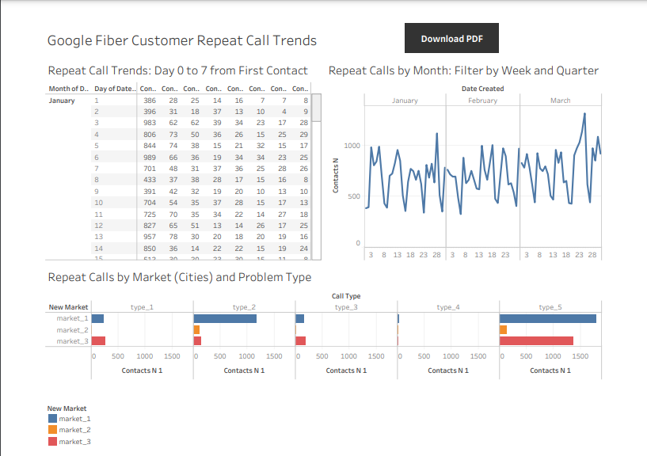
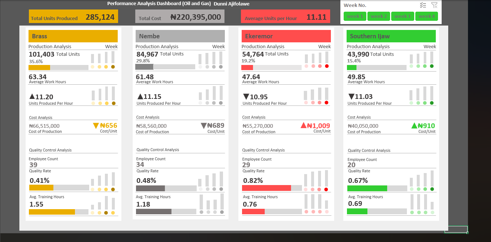

# Portfolio
<!--Section 1: Introduce your self-->
## ABOUT ME

Hi there! I am Oladunni, a highly skilled Data and Business Intelligence Analyst with a passion to help businesses make effective use of their data, from understanding the measures and metrics that are important to them, capturing these measures effectively, and supporting their evidence-based decision-making, for business growth and development.   

<!--Mention your top/relevant skills here - core and soft skills-->
## WHAT I DO

*As an analyst, I translate complex data into valuable and actionable insights with an in-depth knowledge of data manipulations, data modelling, analysis and dashboard building for visualization.*

**- ✅ Skills.**
I have a strong knowledge of Advanced Excel, Power BI, Tableau, SQL, R and PowerPoint. 

**- ✅ Goals.**
My goal as an analyst is to use my proven problem solving, critical thinking and analytical skills to help businesses gain the necessary insights, improve results, and make the right decisions for cost-savings and overall business growth.

<!--Section 2: List 3-4 key projects-->
## MY PORTFOLIO 

*A glimpse of some of the projects I've been working on.*

**Car Sales Performance Analysis**

This Project involved analyzing the sales of cars in an Auto company across six branches

**Goal**: To understand the factors that affect the sales trend across the six branches

**Description**: This project focused on analyzing the performance of the branches and identifying areas with the highest sales volumes, compare sales performance across branches, and understand regional preferences or market trends.The dataset included columns like transaction id, gender, age, location, car model etc. The process involved Extracting, Loading and Tranforming the data, Exploratory Data Analysis, Data Analysis, Modelling, Visualization. It also involves a correlation analysis to determine the correlation between the various dimensions and the corresponding sales.

**Skills**: Data cleaning, Data analysis, Data modelling, Correlation matrices and Data visualization.

**Technology**: Microsoft Excel, Statistical Analysis 

**Results**: The analysis showed that CAR BRANDS and BRANCH LOCATIONS had the highest effect and correlation with sales quantity and the highest selling brands had a minimum of 3 models stocked per brand.

[Read More](https://1drv.ms/b/c/5d8965274b18765c/EXebQy8Y62pEguD5Gbv1uzUBLe8Xwfn8c9AYIvzEz08aFw?e=YciEp8)

**Procurement Cost Analysis.**
 

This Project involved the comprehensive analysis of the procurement data of the Federal Ministry of Health

**Goal**: To evaluate the overall procurement process across various regions and gain insights for an improved procurement process.

**Description**: This project focused on calculating the cost efficiency in procurement across regions, pinpointing areas for potential cost and waste reduction, comparing supplier performance based on cost, and nderstanding factors that support effective supplier selection.

**Skills**: Data cleaning, Data analysis, Data modelling, Cost savings analysis and Data visualization.

**Technology**: Power BI, Statistical Analysis 

**Results**: This equipment procurement cost analysis has shown that the health ministry could make a savings of 137.2% if the cost based supplier recommendation is implemented. This could be achieved baring any impacting factors outside the information provided in the dataset.

**Google Fiber Customer Call Log Analysis.**
 

**Goal**: The goal is to understand how often customers’ phone customer support again after first inquiry and improve customer satisfaction by reducing the number of times customers have to call in. 

**Description**: The dashboard should demonstrate an understanding of the goal and provide insights to stakeholders about repeat calls in the different markets and the problem types these calls represent. The insights should answer the question: How often do customers make repeat calls to the customer service team? 3 datasets were made available for the 3 markets (cities) and these were extracted and merged with a database created in Big Query. The merged target table was then loaded into Tableau for visualization.

**Skills**: Data merging, Data analysis, Data visualization.

**Technology**: SQL, Big Query, Tableau 

**Results**: This call log analysis revealed that market 1 had a very high repeat call rate and would require further analysis of the location, leadership and team working in this city. The most prevalent problem type was Type_5 followed by Type 2. A further analysis would be needed on the factors impacting the resolution of these problem types.

**Performance Analysis (Oil and Gas).**

**Goal**: The primary objective of this project is to utilize the provided dataset to derive actionable insights regarding employee performance, cost efficiency, and quality control. 

**Description**: The aim of this analysis is to calculate and compare the Units Produced per Hour for each location, determine the Cost per Unit Produced for each location to pinpoint areas for potential cost reduction, calculate the Quality Issues Rate to understand the frequency and impact of quality issues on production, analyze the relationship between Overtime Hours and productivity/quality, assess the relationship between Training Hours and productivity/quality metrics, conduct a comparative analysis of key metrics across different rig locations and provide strategic recommendations based on the analysis to enhance productivity. 

**Skills**: Data cleaning, Data Modelling, Statistical Analysis, Data analysis, Correlation analysis and Data visualization.

**Technology**: Microsoft Excel

**Results**: The analysis revealed that only the Brass location had a very strong positive correlation (0.9) between the average training hours per week, and the quality issues rate. There was also a strong positive correlation (0.974) between the average training hours and the units produced per hour. This means that the more training hours invested in the Brass location staff, the lower the percentage rate of quality issues and the higher the number of units produced per hour. It also revealed that the Ekeremor location had an unusually high production cost per unit. A further analysis would be required into the operations of other branches especially Ekeremor with it's high production cost and high percentage of quality issues. The company would need a review of the training programs in the lower performing branches (assumimg the trainings are not uniform across branches) and use the Brass training template as a guide to improve the trainings towards better outputs.

You can find more information on this analysis and more of my visualizations on **Tableau** here...[Read More](https://public.tableau.com/app/profile/dunni.aji/vizzes) 

Click here to view my Google Cyclistic Data Case Study using **R programming** [Read More](https://www.kaggle.com/code/oladunnia/google-cyclistic-data-case-study-1)

You can reach me on: 

[Linkedin](https://www.linkedin.com/in/oa10/)

**Email** [duniiyomi12@googlemail.com]

Thank you!

